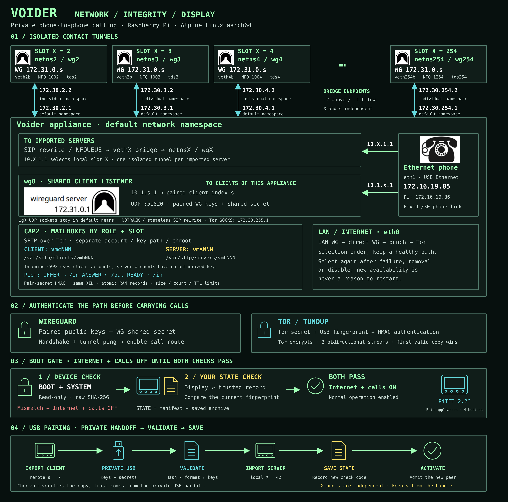

# Voider



[Diagram source (SVG)](docs/diagrams/voider-overview.svg)

<details>
<summary>Network and integrity details</summary>

- **Indexes and routing:** `X` is the local imported-server slot; `s` comes from
  the paired certificate/WireGuard address. They are independent. Each `netnsX`
  contains `wgX = 172.31.0.s`, `vethXb`, and NFQUEUE `1000 + X`. The `.2` bridge
  endpoint is inside `netnsX`; `.1` is in the default namespace. WireGuard UDP
  sockets remain in the default namespace. SIP uses NOTRACK and stateless rewrite.
- **Phone link:** the factory-reset phone uses `172.16.19.85`, with the appliance
  gateway at `172.16.19.86/30` on `eth1`. Readiness is a ping; phone web
  administration is not required. The two blue arrows show dial targets over
  this one physical link. Clients of this appliance share `wg0`.
- **Tor fallback:** `tcs+` serves paired clients and `tds+` serves imported servers;
  the namespace SOCKS helper is `172.30.255.1`. Tor supplies encryption, and
  tundup authenticates using the paired secret and USB fingerprint. Its two
  bidirectional streams deliver the first valid copy.
- **CAP2 mailboxes:** each role and slot has a separate account, key path and
  chroot. Incoming CAP2 uses client accounts; server accounts have no authorized
  key. From the peer, OFFER and READY go to `/in`; ANSWER is read from `/out`.
  Records use pair-secret HMAC, a shared transaction ID, atomic RAM storage,
  and size, count and lifetime limits.

  | Role | Account | Mailbox root |
  | --- | --- | --- |
  | Client | `vmcNNN` | `/var/sftp/clients/vmbNNN` |
  | Server | `vmsNNN` | `/var/sftp/servers/vmbNNN` |

- **Integrity:** the device checks the complete raw BOOT and SYSTEM partitions.
  The human STATE check covers the internal manifest and deterministic saved
  STATE archive. Compare the displayed fingerprint with your trusted record;
  Internet and calls stay off until both checks pass. After an intentional
  STATE change, record the new check code.

</details>

Manual: [German / English / Bulgarian](docs/manual/voider-manual-de-en-bg.pdf)

Voider is a source-available appliance project for private phone-to-phone calling
through small, reproducible Raspberry Pi devices and supported Ethernet phones.

Voider is not FOSS. The source is public so individuals can download it, study it,
modify it, build it, and use it privately for personal and noncommercial purposes.

## License

Personal and noncommercial use is allowed under the terms in [LICENSE](LICENSE).

Commercial use is not granted by downloading this repository. If you want to
manufacture, sell, bundle, host, market, support, certify, brand, or distribute
Voider devices, Voider services, or commercial Voider builds, you need a signed
commercial agreement with the creator.

Companies should use the commercial licensing pack:

[docs/legal/voider-commercial-licensing-pack.pdf](docs/legal/voider-commercial-licensing-pack.pdf)

Contact for commercial licensing: dollner@gmx.de

Got complaints? Please direct them to `/dev/null`.

## Legal Boundary

The custom Voider license applies only to creator-owned Voider materials. Third-party
software, libraries, fonts, operating-system packages, hardware, hardware designs,
product names, and trademarks keep their own licenses and owners. If a third-party
license gives you rights or imposes obligations, that third-party license controls
for that component.

Do not remove copyright notices, license notices, or source-offer obligations from
third-party components. In particular, GPL-covered parts must be handled under GPL
terms where the GPL applies.

Voider is not affiliated with, endorsed by, certified by, or sponsored by Adafruit,
Raspberry Pi, Alpine Linux, Tor, OpenSSH, OpenSSL, WireGuard, or any other
third-party project or vendor named here.

## Hardware

The intended display is the **Adafruit PiTFT 2.2" HAT Mini Kit —
320x240 2.2" TFT, Product ID 2315**, with four physical buttons and no touch
input. Voider is operated using the four buttons.

Use a genuine purchased display module. If you sell devices, respect Adafruit's
product, trademark, reseller, and documentation terms. Do not imply Adafruit
approval or certification.

Voider requires a supported physical display and buttons. Headless installation
is not supported. The installer refuses to continue if the supported display is
not detected.

Use a Raspberry Pi with 64-bit/aarch64 boot support and a 2x20 GPIO header for
the display. The release image uses Alpine's Raspberry Pi kernel and bootloader,
64-bit boot mode.

## Build and flash

Use a Raspberry Pi running **Alpine Linux 3.23, aarch64**, with Internet access
and at least **4 GB free on the disk holding your clone**. These commands assume
an account with `doas` administrator access. Run each block in order; stop if a
command fails. Build on this Pi, then flash a separate microSD card in a USB reader.

Install the build and flashing tools:

```sh
doas apk add git build-base linux-headers openssl-dev libnetfilter_queue-dev \
  python3 util-linux sfdisk dosfstools e2fsprogs tar gzip openssh-client
```

Download the source:

```sh
git clone https://github.com/slave-blocker/voider_ai.git
cd voider_ai
```

Build the programs and prepare the offline installer:

```sh
make -j2
./scripts/stage-release-payload.sh
```

Create the image:

```sh
doas ./scripts/build-release-image.sh
```

Everything stays inside this clone: programs in `build/`, temporary build and
flash files in `image-work/`, and the finished image in `release/`. Temporary
working folders are removed when the scripts exit normally. No `TMPDIR` setting
is needed. The build produces these three files together:

```text
release/voider-aarch64.img.gz
release/voider-aarch64.img.gz.meta
release/voider-aarch64.img.gz.sha256
```

Insert the target microSD card into a USB reader connected to the build Pi.
Identify it by its size and model:

```sh
lsblk -o NAME,SIZE,MODEL,TRAN,MOUNTPOINTS
```

Do not select the disk running the build Pi. Enter the **whole USB card device**,
for example `/dev/sda`, not a partition such as `/dev/sda1`:

```sh
printf 'USB card device: '
read -r CARD
doas ./scripts/flash-release-image.sh release/voider-aarch64.img.gz "$CARD" --readback
```

The flasher validates the source and target, shows the selected disk, and asks
you to type `FLASH /dev/...` before erasing it. Wait for **Flash complete**.
The card must hold at least 940,572,672 bytes (nominal 1 GB or larger).

Management SSH is off by default. To enable it, append
`--ssh-key /path/to/your-public-key.pub` to the flashing command. Supply only a
public key; keep its private key on your management computer.

Put the flashed card in the Voider, connect its supported display and buttons,
Ethernet uplink and supported factory-reset phone, then power it on. Hold
**INSTALL** on the display and follow the instructions. Installation is offline
and requests one reboot. Repeat for the second appliance, then follow the
[manual](docs/manual/voider-manual-de-en-bg.pdf) to pair them and make a call.

## Monero


*Long live the discrete log problem of H.*

## Contact

Please do contact me for critiques, suggestions, questions, kudos, and even mobbing attempts are welcome.

Remember, if your hardware is backdoored anyway, backdoored you are...

@ IRC: **monero-pt**

Special thanks to Andreas Hein!

A donation is the best nation!
